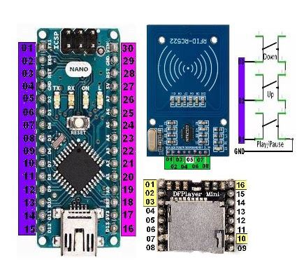
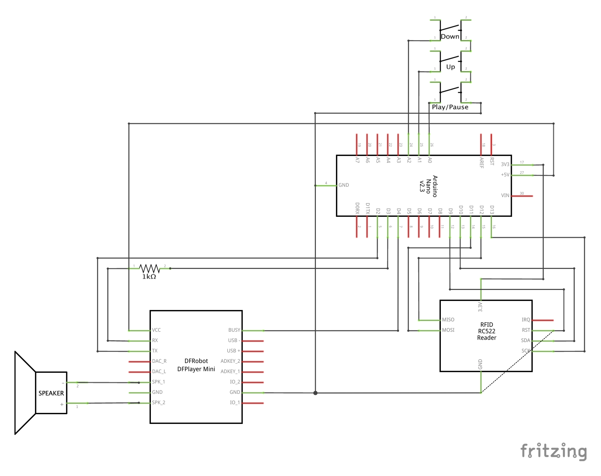

# TonUINO

Die DIY Musikbox (nicht nur) für Kinder.

[](https://github.com/AlexanderWillner/tonuino/actions?workflow=building) [](https://github.com/AlexanderWillner/TonUINO/blob/DEV/LICENSE) [](https://github.com/AlexanderWillner/TonUINO/releases)

- [TonUINO](#tonuino)
  - [English Readers (für unsere englischsprachige Leserschaft)](#english-readers-f%c3%bcr-unsere-englischsprachige-leserschaft)
  - [Zusammenfassung](#zusammenfassung)
  - [Drei Bausteine](#drei-bausteine)
    - [Mikrocontroller-Hardware](#mikrocontroller-hardware)
      - [Notwendige Grundausstattung (ca. 50 EUR)](#notwendige-grundausstattung-ca-50-eur)
      - [Optionale erweiterte Hardwareausstattung (ca. 30-50 EUR)](#optionale-erweiterte-hardwareausstattung-ca-30-50-eur)
    - [Systemnahe Programmierung](#systemnahe-programmierung)
      - [Für Benutzer](#f%c3%bcr-benutzer)
      - [Für Entwickler](#f%c3%bcr-entwickler)
    - [Gehäusebau](#geh%c3%a4usebau)
      - [Notwendige Grundausstattung](#notwendige-grundausstattung)
      - [Optionale erweiterte Gehäuseausstattung](#optionale-erweiterte-geh%c3%a4useausstattung)

## English Readers (für unsere englischsprachige Leserschaft)

For various reasons, we've decided to write this guide in German only. However, you can copy the text from this web page and paste it to [DeepL](https://www.deepl.com/) to easily translate the whole documentation at once.

## Zusammenfassung

Kinder zu beschenken ist nie einfach. Das Ziel des Projektes [TonUINO](https://www.voss.earth/tonuino/) von [Thorsten Voss](https://www.voss.earth/ueber-mich/) ist es, eine “Musikbox (nicht nur) für Kinder” selbst zu bauen. Es macht einen riesigen Spaß, die meisten Kinder sind begeistert und diese Seite soll der großartigen Community etwas wieder geben. Denn so gut die [Webseite](https://www.voss.earth/tonuino/), das [Forum](http://discourse.voss.earth/) und die [Videos](https://www.youtube.com/channel/UCeXF2J1Pz8b1plIne-jQy1A) auch sind, der Bau der ersten Box(en) wäre mit weniger Zeitaufwand möglich.

Insbesondere unterstützt diese Anleitung hier “Newbies” bei der Auswahl der Hardware, geht sequenzieller durch die notwendigen Schritte, beinhaltet Links zu den wichtigsten Informationsquellen und optimiert den Code für Softwareentwickler. Hoffentlich werden diese Anregungen hier irgendwann in die offizielle Dokumentation aufgenommen und machen diese Seite damit zukünftig überflüssig. Jede Art von [Pull Requests](https://help.github.com/en/github/collaborating-with-issues-and-pull-requests/about-pull-requests) oder [Issues](https://github.com/alexanderwillner/tonuino/issues), die die Dokumentation oder den Code gemeinsam verbessern, sind mehr als willkommen!

## Drei Bausteine

Es ist wichtig zu wissen, dass die Kunst ein TonUINO zu bauen grundsätzlich als ein Zusammenspiel von drei unterschiedlichen Disziplinen angesehen werden kann: [Mikrocontroller-Hardware](#mikrocontroller-hardware), [systemnahe Programmierung](#systemnahe-programmierung) und [Gehäusebau](#geh%c3%a4usebau). Im Folgenden wird für jeden der Bereiche die notwendige Grundausstattung und sinnvolle Erweiterungen sehr knapp vorgestellt. Das [Forum](http://discourse.voss.earth/) ist ein Quell vieler weiterer Ideen.

### Mikrocontroller-Hardware

Es muss gelötet werden. Wir gehen davon aus, dass Lötkolben, Lötzinn und Löterfahrung vorhanden sind. Eine sehr gute Anleitung gibt es bei [YouTube](https://www.youtube.com/watch?v=RmE09dsY-l0) und einen Schaltplan auf der [offiziellen Webseite](https://www.voss.earth/tonuino/). Da hier jedoch die genaue Orientierung der Pins nicht ersichtlich ist, hilft auch noch ein alternativer Schaltplan von [dieser Webseite](https://smarthomeyourself.de/anleitung-zum-selber-bauen/unabhaengige-projekte/tonuino-der-kinderfreundliche-rfid-audio-player/), um die richtigen Pins zu identifizieren. Auf Basis eines [Forum-Beitrages](http://discourse.voss.earth/t/einfacher-schaltplan/5021) im Folgenden eine tabellarische Übersicht:

| Text | Pin | Gerät | Ardunio: Pin | Ardunio: Text | Ardunio: Text | Ardunio: Pin | Gerät | Pin | Test |
| ---  | --- | ---   | ---          | ---           | ---           |          --- |   --- | --- | ---  |
|      |     |       | 01           | D0            | Vin           | 30           |       |     |      |
|      |     |       | 02           | D1            | GND           | 29           | RFID  | 6   | GND  |
|      |     |       | 03           |               |               | 28           |       |     |      |
| GND  | 10  | MP3   | 04           | GND           | 5V            | 27           |       |     |      |
| TX   | 3   | MP3   | 05           | D2            | A7            | 26           |       |     |      |
| RX   | 2   | MP3   | 06           | D3            | A6            | 25           |       |     |      |
| BSY  | 16  | MP3   | 07           | D4            | A5            | 24           |       |     |      |
|      |     |       | 08           | D5            | A4            | 23           |       |     |      |
|      |     |       | 09           | D6            | A3            | 22           |       |     |      |
|      |     |       | 10           | D7            | A2            | 21           | Knopf | 3   | -    |
|      |     |       | 11           | D8            | A1            | 20           | Knopf | 2   | +    |
| RST  | 7   | RFID  | 12           | D9            | A0            | 19           | Knopf | 1   | Play |
| SDA  | 1   | RFID  | 13           | D10           | REF           | 18           |       |     |      |
| MOSI | 3   | RFID  | 14           | D11           | 3,3V          | 17           | RFID  | 8   | 3,3V |
| MISO | 4   | RFID  | 15           | D12           | D13           | 16           | RFID  | 2   | SCK  |

Die passenden Abbildungen:

  

#### Notwendige Grundausstattung (ca. 50 EUR)

Die notwendigen Komponenten können über Reichelt, Conrad, Amazon, E-Bay oder Alibaba bezogen werden. Meist lohnt sich jetzt schon die Planung von mehreren TonUINO-Boxen (dann kostet eine Box deutlich weniger). Im Folgenden Amazon-Affiliate-Links von Komponenten, die Thorsten und andere aus der Community erfolgreich verbaut haben. In der [Community Hardware FAQ](https://discourse.voss.earth/t/faq-kategorie-hardware/926/2) gibt es weitere wertvolle Hinweise.

| Anzahl | Produkt | Beschreibung | Hinweis | Kosten |
| --- | --- | ---  | --- | --- |
| 1 | [TonUINO Set](https://amzn.to/2pHTJQ3) | Die Hauptkomponenten | Sollte das Set ausverkauft sein, im Folgenden die vier Komponenten | ca. xx EUR / Stück |
| (1)| [Arduino Nano](https://amzn.to/2mQNHaY) | Zum Ansteuern | Es können auch andere Arduino-Varianten gekauft werden | ca. 4 - 8 EUR / Stück |
| (1) | [DFPlayer Mini](https://amzn.to/2K2JavA) | Zum Abspielen der Musik | Dieser Player ist recht empfindlich was die genaue Bespielung der SD-Karte angeht | ca. 3-6 EUR / Stück |
| (1) | [Mini-USB-Kabel](https://amzn.to/2J2qv4E) | Zur Stromversorgung |  | ca. 2-4 EUR / Stück |
| (1) | [USB-Netzteil](https://amzn.to/3b9zUnb) | Zur Stromversorgung |  | ca. 5 EUR / Stück |
| (1) | [RFID Kit RC522](http://amzn.to/2FnyHJj) | Zum Lesen und Beschreiben der NFC-Karten |  | ca. 2-6 EUR / Stück |
| (4) | [RFID-Karten](https://amzn.to/2NXZQuL) | Zur Auswahl der Musik | müssen im 13,56 MHz Band funken | ca. 0,40 - 0,80 EUR / Stück |
| 1 | [Passiver Lautsprecher](https://amzn.to/396S73b) | Zum Anhören der Musik | z.B. ein Regallautsprecher oder etwas kleineres | ca. 2-50 EUR / Stück |
| 1 | [MicroSD-Karte](http://amzn.to/2oXOxDw) | Zum Speichern der Musik | Maximal 32 GB | ca. 4-6 EUR / Stück |
| 3 | [Knöpfe](https://amzn.to/3bdiKoR) | Zum starten/stoppen, lauter/leiser stellen, ... | Es gibt auch Varianten mit 5 Knöpfen. Knöpfe mit eingebauter LED haben weitere Vorteile. | ca. 0,50 EUR / Stück |
| 20 | [Kabel](https://amzn.to/2Ur116x) | Zum Verbinden | Der Bedarf an Kabeln kann schnell nach oben gehen (siehe Erweiterungen unten) | ca. 0,05 EUR / Stück |
| 1 | [1K Resistor](https://amzn.to/3a3HuzG) | zum X | Einzeln zu kaufen ggf. recht teuer | ca. 0,01 EUR / Stück |

#### Optionale erweiterte Hardwareausstattung (ca. 30-50 EUR)

| Anzahl | Produkt | Beschreibung | Hinweis | Kosten |
| --- | --- | ---  | --- | --- |
| 1 | [TonUINO-Platine](http://discourse.voss.earth/t/neue-platine-version-1-51/63) | Für weniger Kabelsalat. Enthält auch die o.g. Kabel und den Resistor. Wird auch in der o.g. YouTube-Anleitung genutzt. | Kann von Thorsten [per E-Mail](TonUINO@voss.earth) bestellt werden | ca. 10 EUR / Stück
| 1 | [Köpfhörer-Platine](http://discourse.voss.earth/t/kopfhoererbuchsenplatine/2463) | Zum Anschluss von Kopfhörern |Kann von Thorsten [per E-Mail](TonUINO@voss.earth) bestellt werden. Alternativ [der klassische Weg](https://discourse.voss.earth/t/kopfhoereranschluss-moeglich/96/84). | ca. 7,50 EUR / Stück
| 1 | [Akku](https://amzn.to/33w0BQz) | Zum Kabellosen Betrieb | Dazu gibt es einige [Diskussionen](http://discourse.voss.earth/c/stromversorgung/5) und Alternativen (z.B. Wemos Battery Shield). Gute Erfahrungen gibt es mit dem Hersteller RAVPower. Wichtige Eigenschaften: power pass trough, automatische Abschaltung. | ca. 15 EUR / Stück |
| 1 | [Micro-SD-Verlängerung](https://amzn.to/2J0qZsk) | Zum Austausch der SD-Karte von außen | Je nachdem wie das Gehäuse gebaut ist. Auch könnte eine externe USB-Buchse genutzt werden, [um MP3-Dateien aufzuspielen](http://discourse.voss.earth/t/daten-auf-sd-kopieren-ueber-usb-anschluss/2185/8). Das Kabel kann allerdings unter Umständen die [Autoabschaltung verhindern](https://discourse.voss.earth/t/sd-verlaengerungskabel-verhindert-poweroff/1780/4). | ca. 3 EUR / Stück |
| 1 | [USB-Buchse](https://amzn.to/2QvkPEJ) | Zum Aufladen bei Akkubetrieb | [Kein einfaches Thema](http://discourse.voss.earth/t/micro-usb-buchse-fuer-das-gehaeuse/3280/14) und kann sowohl zum Aufladen als auch für ein [Firmware-Upgrade](http://discourse.voss.earth/t/benoetige-hilfe-bei-der-trennung-von-daten-und-strom-des-usb-kabels/975) oder zum [MP3-Aktualisieren](http://discourse.voss.earth/t/daten-auf-sd-kopieren-ueber-usb-anschluss/2185/8) gleichzeitig genutzt werden. | ca. 4-20 EUR / Stück |
| 1 | [Ein- und Ausschalter](https://amzn.to/2QvhqWl) | Zum Strom sparen und Wiederbeleben bei Akkubetrieb | Ein Schalter mit Lichtindikator erscheint sinnvoll [für eine gewisse Grundlast](http://discourse.voss.earth/t/grundlast-erhoehen-um-powerbank-nicht-autom-abzuschalten/1899/9) | ca. 0,50-20 EUR / Stück|
| Mehrere | [Etiketten](https://amzn.to/2R0eHSL) | Zum Bekleben der NFC-Karten, denn diese müssen irgendwie auseinandergehalten werden | Es gibt ganz viele weitere Varianten zum Bedrucken. Am Ende sollte ein [DIN EN71-3 Klarlack](https://amzn.to/3dmy18K) aufgetragen werden. Ein einfacher Edding zum Beschriften reicht jedoch auch.| ca. 0,80 EUR / Stück|
| 1 | [Bluetooh-Sender](https://amzn.to/3b7N443) | Zum Anschluss von kabellosen Kopfhörern | Details zum Anschluss im Forum [hier](http://discourse.voss.earth/t/hoerbuch-fuer-meine-frau/4344/3) oder [hier](http://discourse.voss.earth/t/erweiterung-anschluss-bluetooth-kopfhoerer-vorerst-theorie/3556/14). | ca. 19 EUR / Stück |

Es gibt zahllose weitere Ergänzungen, wie [LED-Stripes](http://discourse.voss.earth/t/integration-led-strip-und-ring-mit-neopixel/2760) etc. pp. Positive Erfahrungen sollten gerne in diese Liste hier integriert werden.

### Systemnahe Programmierung

Es muss nicht unbedingt programmiert werden. Die Installation der Firmware auf den Arduino ist sehr einfach. Die Anleitung auf der [offiziellen Webseite](https://www.voss.earth/tonuino/) ist gut. Wenn jedoch mehr Knöpfe angesprochen werden sollen (siehe oben), muss die Software auch geringfügig angepasst werden.

Es gibt zwar, wie bei jeder Software, ein paar kleine Software-Fehler, die jedoch in [unterschiedlichen Branches](https://github.com/xfjx/TonUINO/network) gefixt wurden. Ziel ist es, diese Änderungen in so wenigen Branches wie möglich pflegen zu müssen.

#### Für Benutzer

Als einfacher Benutzer sollte die Programmierung so einfach gestaltet sein wie möglich. Im Folgenden die notwendigen Schritte. Eine [Community Software FAQ](https://discourse.voss.earth/t/faq-kategorie-software/924) gibt weitere Hilfestellungen. Unten gibt es einen Ablauf als Video.

1. Download [der aktuellen Firmware](https://github.com/AlexanderWillner/TonUINO/releases/latest/download/TonUINO.zip).
2. Die Datei `TonUINO.zip` landet dann im `Download`-Verzeichnis und muss mit einem Doppelklick entpackt werden. Es sollte dann ein Verzeichnis `TonUINO` existieren, in der sich die Datei `Tonuino.ino` befindet.
3. Anschließend muss die [Arduino GUI](https://www.arduino.cc/en/main/software) herunter geladen und installiert werden (unter macOS mit [Homebrew](http://brew.sh) einfach über `brew cask install arduino`).
4. Nach dem Starten der Arduino GUI muss die o.g. Datei geöffnet werden und notwendige Bibliotheken herunter geladen werden. Unter `Werkzeuge` und dann `Bibliotheken Verwalten` folgende Pakete suchen und installieren:
   1. `JC_Button` (von dem Entwickler `Jack Christiansen`)
   2. `DFPlayer Mini Mp3` (von dem Entwickler `Makuna`)
   3. `MFRC522` (von dem Entwickler `GitHubCommunity`)
5. Nun unter `Werkzeuge` und dann 
   1. `Board` den Punkt `Arduino Nano` auswählen
   2. `Prozessor` den Punkt `ATmega328P (Old Bootloader)` auswählen
   3. `Port` den Punkt `/dev/cu.wchusbserial???` auswählen (je nach Betriebssystem könnte es anders aussehen)
6. Nun kann die Software unter `Sketch` und dann `Hochladen` auf den Arduino hoch geladen werden.

Kurzanleitung zum Aufspielen der Firmware für Benutzer (auf das Video klicken):

[](https://youtu.be/OxXnBpHxEyY)

Darüber hinaus muss noch die SD-Karte vorbereitet werden:

1. Die Karte mit FAT32 formatieren.
2. Die Ordner `mp3` und `advert` aus dem Ordner `sd-card` müssen auf die SD-Karte kopiert werden. Skripte wie `create-soundfiles.sh` brauchen gar nicht ausgeführt werden.
3. Auf der SD-Karte müssen die Ordner für die Musik erstellt werden (ohne Lücken beginnend mit `01`, dann ggf. `02`, ...) und die MP3-Dateien der Lieder müssen ohne Lücken nummeriert werden (mit `001`, dann ggf. `002`, ...).
4. Die Codierung der NFC-Karten und des Admin-Menüs wird durch [die Videos](https://www.youtube.com/channel/UCeXF2J1Pz8b1plIne-jQy1A) deutlich und sind weitestgehend selbsterklärend.

#### Für Entwickler

Der Ablauf für Entwickler sieht etwas anders aus und dieses Repository hat sich zum Ziel gesetzt, insbesondere diese Zielgruppe mit zu unterstützen. Insbesondere die Unterstützung von [Arduino CLI](https://github.com/arduino/arduino-cli),[PlatformIO](https://platformio.org) und [GitHub Actions](https://github.com/AlexanderWillner/tonuino/actions?workflow=building) wurde umgesetzt. Für diese Zielgruppe sollte insbesondere das `Makefile` eine Hilfe sein, die alle o.g. Punkte und weitere Aspekte automatisiert:

```text

$ make
TonUINO Makefile
================

 Configured to use MCU "arduino:avr:nano:cpu=atmega328old" attached to port "/dev/cu.usbserial-1410".

Available commands:
- help     : get support from the community
- install  : installation of required binaries (arduino-cli)
- init     : initialize environment (arduino-cli)
- compile  : create binary
- upload   : store binary on board flash
- find     : get information about the pluged-in board
- test     : run some basic tests on the code
- clean    : delete temporary files
- feedback : provide feedback and report issues
```

Kurzanleitung zum Aufspielen der Firmware für Entwickler:

[](https://asciinema.org/a/kmkM7vLLSfYFLPr55jBCcEUEe)

Darüber hinaus gibt es

- auf der [offiziellen Webseite](https://www.voss.earth/tonuino/) und im Repository noch einige nützliche Skripte, die noch nicht in das `Makefile` integriert sind
- [Firmware-Alternativen](https://github.com/seisfeld/TonUINO), die je nach Planung ggf. weitere notwendige Features unterstützen
- die [Fritzing GUI](https://fritzing.org/), um kompliziertere Aufbauten zunächst am Rechner zu visualisieren und zu planen (unter macOS mit [Homebrew](http://brew.sh) einfach über `brew cask install fritzing`)
- ein [change log](CHANGELOG.md), die Änderungen der Software dokumentiert

### Gehäusebau

Man sollte kreativ werden. Nach dem Zusammenbau der Hardware, dem Aufspielen der Firmware, dem Befüllen der SD-Karte und der Codierung der ersten NFC-Karte, kann man direkt loslegen. Allerdings ist so ein Kabelsalat weder hübsch noch Kind-gerecht.

#### Notwendige Grundausstattung

Eine stabile Pappschachtel (z.B. die Verpackung des Mobiltelefons oder eine Taschentuchbox) zusammen mit einem günstigen Lautsprecher oder eine fertige Lautsprecherbox aus Holz. Eine Heißklebepistole oder doppelseitiges Klebeband können zum besten Freund werden.

#### Optionale erweiterte Gehäuseausstattung

Es gibt erstaunliche Arbeiten, die z.B. in der [Gallerie](http://discourse.voss.earth/t/tonuino-gehaeuse-galerie/786/27) aufgeführt sind, und hier kommt die eigentliche Kreativität zum Einsatz ([Stofftiere](http://discourse.voss.earth/t/die-musikeule-ein-stofftier-mit-kick/2541), [Schatzkisten](http://discourse.voss.earth/t/vorstellung-musik-schatzkiste/2641), [LED-bestückte Jukeboxen](http://discourse.voss.earth/t/vorstellung-marabox-bambus-3d-druck-neopixel-ring/4608/22), ...). Hier kann mit einem 3D-Drucker kann das eigene Projekt natürlich noch auf eine ganz andere Ebene gehoben werden.
